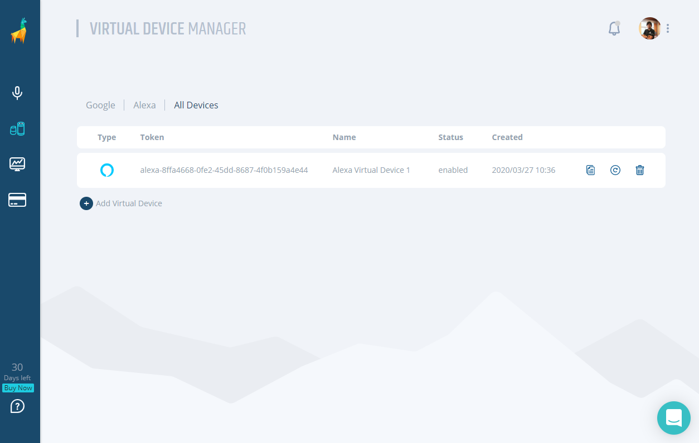
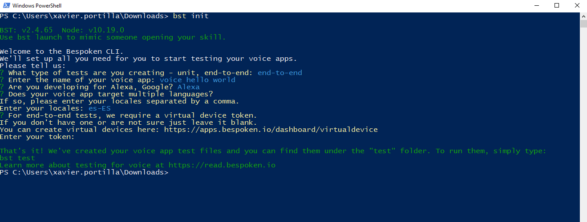
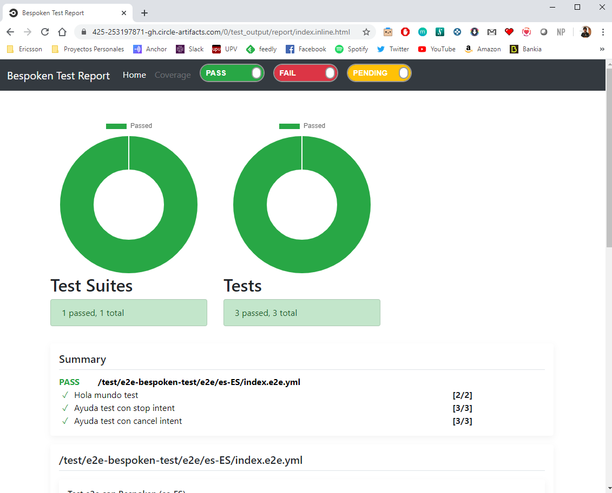

# DevOps your Skill: End-to-end Tests

This type of test allows us to verify if the interaction of the software components in our Alexa Skill, such as, VUI, lambda or a database works as expected. 
In summary, End-to-end testing tests the application's ability to satisfy all the requests that the end user can make.

In terms of voice it is not easy to achieve this kind of tests because of the interaction of the voice as an input of the end-to-end test. We will use Bespoken to write our end-to-end tests. Bespoken allow us to make this kind of tests in an easy way!

These tests are automated in the continuous integration system (CircleCI) and are executed in each new version of the software.

## Prerequisites

Here you have the technologies used in this project
1. ASK CLI - [Install and configure ASK CLI](https://developer.amazon.com/es-ES/docs/alexa/smapi/quick-start-alexa-skills-kit-command-line-interface.html)
2. CircleCI Account - [Sign up here](https://circleci.com/)
3. Bespoken Account - [Register here](https://bespoken.io/)
4. Node.js v10.x
5. Visual Studio Code

## Bespoken

Bespoken is the best tool to test our Alexa Skill. From unit tests to end-to-end tests. If we take a look of its official documentation:

Bespoken makes it easy to do end-to-end testing for voice apps.

They use Virtual Devices to do it. A virtual device works like a physical device, such as Amazon Echo, but can be interacted with via Bespoken simple test scripting syntax (as well as programmatically via Bespoken API).

As Bespoken says, there is a lot going on under the covers, but the tests themselves are very easy to write and maintain - in fact, they believe it's as easy to type the tests as it is to manually say them. And once they have been written, you have an automated test suite, that can be run at any time and incorporated into other automated processes (such as continuous integration/continuous delivery).

We have written, tested and run tests using Bespoken and we can conclude that is the best test tool for voice apps you can use!

### Installation

The Bespoken tool is included in the [Docker image](https://hub.docker.com/repository/docker/xavidop/alexa-ask-aws-cli) we are using so it is not necessary to install anything else.

### Configuration

The configuration in Bespoken is really easy. We only need to have a Bespoken Account and create a virtual device in its easy-to-use website:



As our Docker image has the `bespoken-tools` npm package installed, mentioned in the previous section, we can run the command that will set up our test suite:

```bash
  bst init
```

This command will prompt the following step-by-step guide:



Where we will have to enter the following information:
1. The type of tests we you creating. In our case, end-to-end tests.
2. The name of your voice app. In our case, version dos.
3. The available locales. In our case es-ES.
4. The platform we are using, In our case Alexa.
5. And finally, the token of the virtual device we have created above.

After running that command, Bespoken will create a json file `testing.json` and a `e2e` folder with an example of an end-to-end test.

First, we will take a look to our `testing.json` file:

```json
  {
      "virtualDeviceToken": "alexa-8ffa4668-0fe2-45dd-8687-4f0b159a4e44",
      "locales": "es-ES",
      "type": "e2e",
      "platform": "alexa"
  }
```

Really easy, right? In that file we can see the input we entered in the `bst init` command.

In order to have the repo well structured, all the bespoken files are located in `test/e2e-bespoken-test` folder.

Now we are ready to write our end-to-end test suite.

### Writing end-to-end tests

In this step of the pipeline we are going to develop some end-to-end tests written using Bespoken.

Once we have tested our Voice User Interface, our backend and those systems together using text as input and we check that everything is correct. It is time to test all software components related in an Alexa Skill request. **But now, using the voice as input.**

In the folder `test/e2e-bespoken-test/e2e` you can find the test suite file `index.e2e.yml`. This is how this file looks like:

```yaml

  ---
  configuration:
    locale: es-ES
    description: Test e2e con Bespoken
  ---
  - test : Hola mundo test
  - abre version dos: "bienvenido puedes decir hola o ayuda"
  - hola: 

  ---
  - test : Ayuda test con stop intent
  - abre version dos: "bienvenido puedes decir hola o ayuda"
  - ayuda: "puedes decirme hola * ayudar"
  - para: "hasta *"

  ---
  - test : Ayuda test con cancel intent
  - abre version dos: "bienvenido puedes decir hola o ayuda"
  - ayuda: "puedes decirme hola * ayudar"
  - cancela: "hasta *"

```
As you can see we have 3 tests in this suite:
1. The first one will test a launch request and the HelloWorld intent.
2. The second one will test a launch request, the AMAZON.HelpIntent and will end the session using the AMAZON.StopIntent.
3. The third one will test a launch request, the AMAZON.HelpIntent and will end the session using the AMAZON.CancelIntent.

This end-to-end tests can be performed with the `bespoken-tools` nppm package. we will use the following `bst` command:

```bash
  bst test --config test/e2e-bespoken-test/testing.json
```

When we execute this suite, this is what happens in Bespoken:

* Bespoken turns the text input of the test into audio using text-to-speech from Amazon Polly.
* Bespoken send the speech audio to Alexa.
* Alexa invokes the skill.
* The skill provides a reply - a combination of audio (the vocal response from Alexa) and metadata (for card information).
* We turn the response back into text using speech-to-text.
* We compare it to the expected output.
  

### Reports

Once we have executed the suite explained above, the `bespoken-tools` npm package will create a fabulous HTML report located in `test_output/`.

In this report we can check how that execution went.

This is how this report looks like:



This report will be stored as an artifact of this job in CircleCI.

### Integration

It is not necessary to integrate it in `package.json` file.

## Pipeline Job

Everything is ready to run our end-to-end tests, let's add it to our pipeline!

This job will execute the following tasks:
1. Restore the code that we have downloaded in the previous step in `/home/node/project` folder
2. Run the Bespoken end-to-end tests using the command `bst test`.
3. Store the HTML report generated by the previous execution as an artifact of this job.
4. Persist again the code that we will reuse in the next job

```yaml

  end-to-end-test:
    executor: ask-executor
    steps:
      - attach_workspace:
          at: /home/node/
      - run: bst test --config test/e2e-bespoken-test/testing.json
      - store_artifacts:
          path: test_output/
      - persist_to_workspace:
          root: /home/node/
          paths:
            - project

```

## Resources
* [DevOps Wikipedia](https://en.wikipedia.org/wiki/DevOps) - Wikipedia reference
* [Official Bespoken Documentation](https://read.bespoken.io/end-to-end/getting-started/) - Bespoken Documentation
* [Official CircleCI Documentation](https://circleci.com/docs/) - Official CircleCI Documentation

## Conclusion 

The main reason for carrying out this testing is to determine various dependencies of an application as well as ensuring that accurate information is communicated between various system components.
Thanks to Bespoken we can perform this complex tests.

I hope this example project is useful to you.

That's all folks!

Happy coding!
